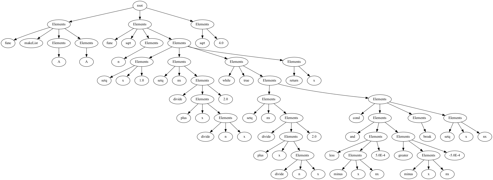

# F-language
The F language can be considered as a reduced version of the Lisp language with some simplifications and modifications. It takes the basic syntax and semantics from Lisp.

## AST Visualization

To visualize the output of a parser, you should have graphviz utility pre-installed and `dot` command available in your command-line interface. Run `Main.java` having a language snippet stored in `input.txt`. Results will be two files: `output.dot` that contains an input string in DOT language for the graphviz and `output.png`. 

**Example**:



## Syntax Highlighting

In case you prefer to write code in VSC you can use syntax highlighting. `/extension` contains extension for VSC. You need to add it to `.vscode/extensions` folder. After that you can write code in `.f` files. 
Please note that this is just syntax highlighting that works at the lexer level and cannot highlight unused variables

**Example**:


## Semantic Highlighting and LSP

🚧 WIP

## Lexer
Lexical analysis is performed with a help of JFlex utility. To be able to run the program you should firstly generated a `Lexer` class. To do it you should have JFlex install and configured on your computer.

```bash
jflex ./lexer/lisp.flex -d ./src/lex
```

In case you are not able to run jflex, consider using pre-generated `Lexer.java` file 