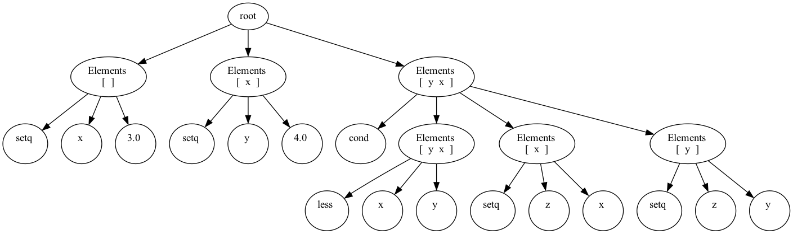

# Live variables analysis
This package performs live variables static analysis. 
It enhances each ```Element``` of abstract syntax tree with ```AnalysisData```:
```kotlin
data class AnalysisData(
    val gen: Set<String> = mutableSetOf(),
    val kill: Set<String> = mutableSetOf(),
    var setIn: Set<String> = mutableSetOf(),
    val setOut: Set<String> = mutableSetOf()
)
```
where 
- `gen` - set of variables read by current element
- `kill` - set of variables written by current element
- `setIn` - set of live variables when element is entered during execution
- `setOut` - set of live variables when element is left

The aim of live variables analysis is to determine `setIn`
## Algorithm
This is a backwards may analysis. Initially all values are empty sets.

Then, the equations for the values are the following:

- setIn<sub>i</sub> = gen<sub>i</sub> &cup; ( setOut<sub>i</sub> &setminus; kill<sub>i</sub> )
- setOut<sub>i</sub> = succ<sub>1</sub> &cup; succ<sub>2</sub>... succ<sub>n</sub>,

where i is the current expression and succ are all its successors (elements to be evaluated after current elements).
Therefore the  confluence  operator is union.

## Code
The code is traversing through elements in 
```kotlin
fun calculateLiveVariables(element: Element,
    input: AnalysisData,
    isSequental: Boolean = false)
```
where isSequential - a sign whether given element is evaluated sequentially or not (to determine predecessors)
- `gen` and `kill` for each argument is calculated. The only cases of `kill` - of variables being written are:
  - `setq` - a special form that writes to the identifier
  - `func` - a special form that defines the name of some function (and writes to such name) and declares local variables (writing to them as well)
  - `prog` and `lambda` - both declare local context variables
So, all there forms are treated differently. For any other element, any reference to an identifier is considered as variable being read.
- Analysis is performed for all nested elements, since they are evaluated before the current element and are considered successors
- `setIn` and `setOut` are calculated

## Visualization

To visualize the output of an analysis, you should have graphviz utility pre-installed and `dot` command available in your command-line interface. Run `Main.java` with `analyse` as the first argument and `"your code text"` as the second. Results will be two files: `output.dot` that contains an input string in DOT language for the graphviz and `output.png`. 

**Example:**
For code 
```
(setq x 3)
(setq y 4)
(cond (less x y) (setq z x) (setq z y))
```
The output of analyzer is the following
